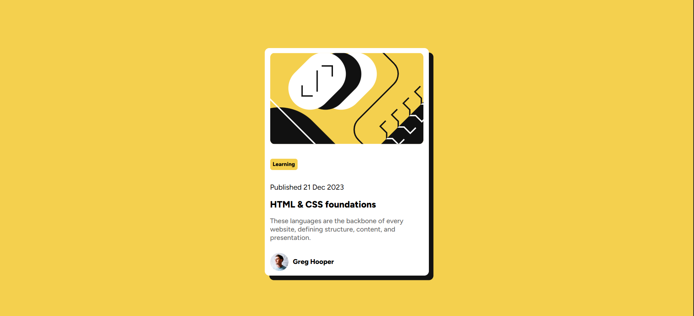

# Frontend Mentor - Blog preview card solution

This is a solution to the [Blog preview card challenge on Frontend Mentor](https://www.frontendmentor.io/challenges/blog-preview-card-ckPaj01IcS). Frontend Mentor challenges help you improve your coding skills by building realistic projects. 

## Table of contents

- [Overview](#overview)
  - [The challenge](#the-challenge)
  - [Screenshot](#screenshot)
  - [Links](#links)
  - [Built with](#built-with)
  - [What I learned](#what-i-learned)
  - [Continued development](#continued-development)
- [Author](#author)

**Note: Delete this note and update the table of contents based on what sections you keep.**

## Overview

This is my solution to the **Blog Preview Card** challenge from Frontend Mentor.  
The goal of this project was to recreate the given design as closely as possible using only **HTML and CSS**, while focusing on layout, spacing, typography, accessibility, and responsiveness.

### The challenge

Users should be able to:

- See hover and focus states for all interactive elements on the page

### Screenshot



### Links

- Solution URL: [Add solution URL here](https://your-solution-url.com)
- Live Site URL: [Add live site URL here](https://your-live-site-url.com)

### Built with

- Semantic HTML5 markup  
- CSS custom properties  
- Flexbox  
- Responsive Units (`vh`, `%`, `rem`)
- Mobile-first workflow  
- Custom font embedding via `@font-face`

### What I learned

Working on this project helped me strengthen:

- How to center a container both **horizontally and vertically** using `display: flex` and `height: 100vh`
- The use of **box-shadow** and **border radius** to create clean UI cards
- How Flexbox helps align elements like the profile image and text side-by-side
- The difference between layout behavior such as `float`, `inline`, `block`, and `flex`
- How to apply **media queries** to improve responsiveness on small screens

Here’s a small snippet I’m proud of:

```css
body {
  background-color: hsl(47, 88%, 63%);
  display: flex;
  align-items: center;
  justify-content: center;
  height: 100vh;
}

### Continued development

In future projects, I want to:

- Improve responsiveness and layout scalability using CSS Grid
- Follow an even more consistent mobile-first approach
- Add animations, hover states, and transitions for better UX
- Ensure accessibility improvements such as proper role attributes and alt text formatting
- Practice writing cleaner, reusable CSS — potentially using BEM naming structure


## Author

- Frontend Mentor - [@Riddhith](https://www.frontendmentor.io/profile/Riddhith)
- Twitter - [@RidBanerjee](https://x.com/RidBanerjee)
- Github - [@Riddhith](https://github.com/Riddhith)